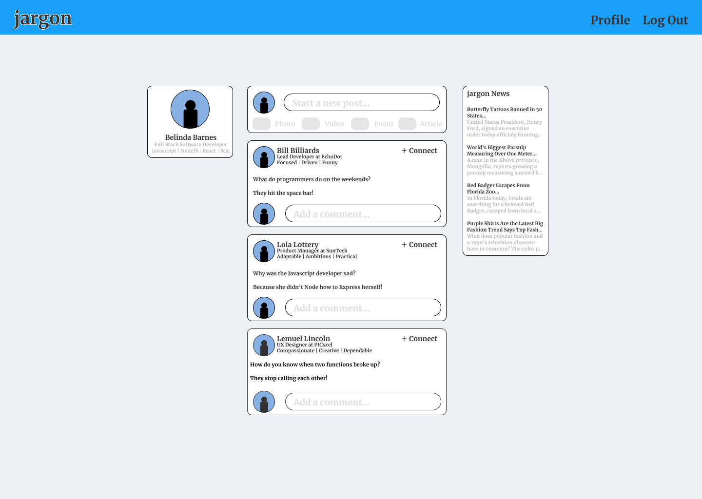
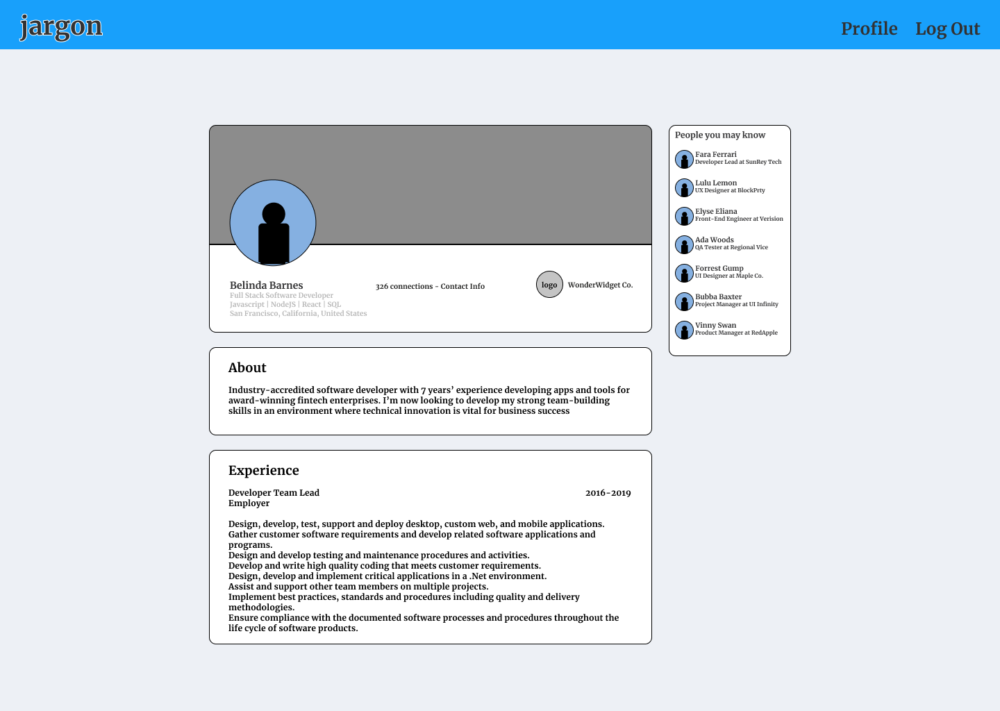

# jargon

## Description

**jargon** is an employment-oriented networking application that connects veterans in tech to training and employment resources.

## User Stories

**MVC**

- As an unregistered user, I would like to be able to register for an account
- As a registered user, I would like to be able to edit my profile
- As a registered user, I would like to be able to write blog posts
- As a registered user, I would like to be able to add comments to blog posts
- As a registered user, I would like to be able to delete blog posts
- As a registered user, I would like to be able to delete comments
- As a registered user, I would like to _connect_ to other registered users
- As a registered user, I would like to be able to view a feed featuring blog posts from other registered users

**UPDATES**

- As an unregistered user, I would like to be able to view job listings
- As an unregistered user, I would like to be able to view user profiles
- As an unregistered user, I would like to be able to view employer profiles

## Wireframes

## Database Design

**This** diagram represents the initial database structure, necessary to meet MVC.
