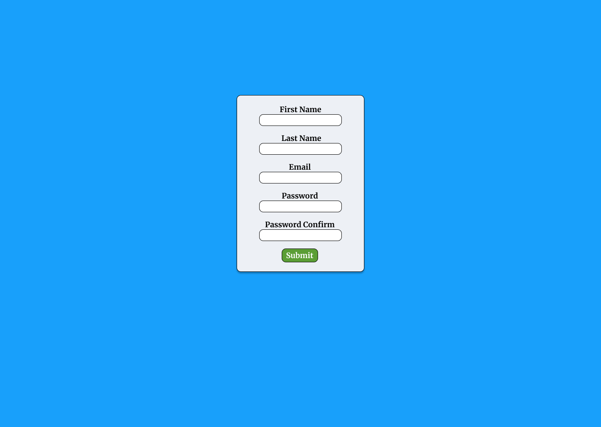
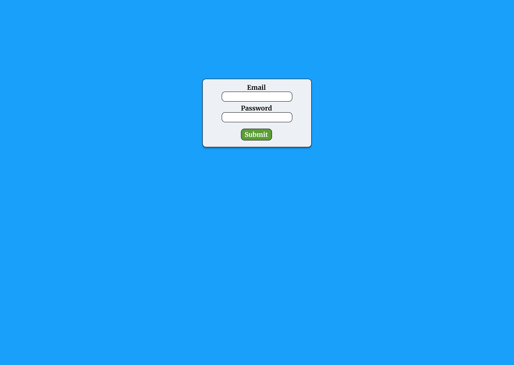

# jargon

## Description

One of the greatest challenges Veterans face when breaking into tech is envisioning themselves within the industry. Coming from a notoriously ridged culture, veterans are often intimidated by the seemingly relaxed atmosphere present in tech. With fears and insecurities swarming, sometimes it helps to find others who speak the **jargon**. 

**jargon** is a networking and employment oriented application that connects veterans in tech to colleagues and peers, mentors and employers, training resources, and job opportunities. By creating a networking community of vets in tech, **jargon** breaks down the barriers of entry many veterans face, and narrows the market for veterans seeking careers and connections within the industry. 

## User Stories

**MVC**

- As an unregistered user, I would like to be able to register for an account
- As a registered user, I would like to be able to edit my profile
- As a registered user, I would like to be able to write blog posts
- As a registered user, I would like to be able to add comments to blog posts
- As a registered user, I would like to be able to delete blog posts
- As a registered user, I would like to be able to delete comments
- As a registered user, I would like to _connect_ to other registered users
- As a registered user, I would like to be able to view a feed featuring blog posts from other registered users

**Later Versions**

- As an unregistered user, I would like to be able to view job listings
- As an unregistered user, I would like to be able to view user profiles
- As an unregistered user, I would like to be able to view employer profiles

## Screenshots

## Wireframes

## Database Design

**This** diagram represents the initial database structure, necessary to meet MVC.

## Future Development

## Credits
[UI Design](https://github.com/bedimcode/portfolio-responsive-complete)
[LandingSVG](https://www.humaaans.com/)